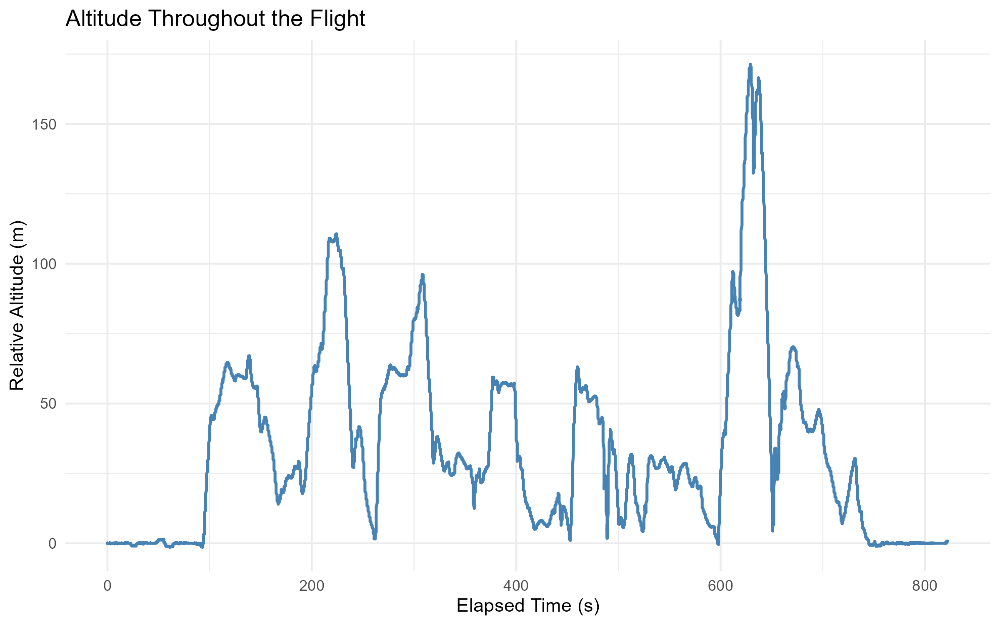
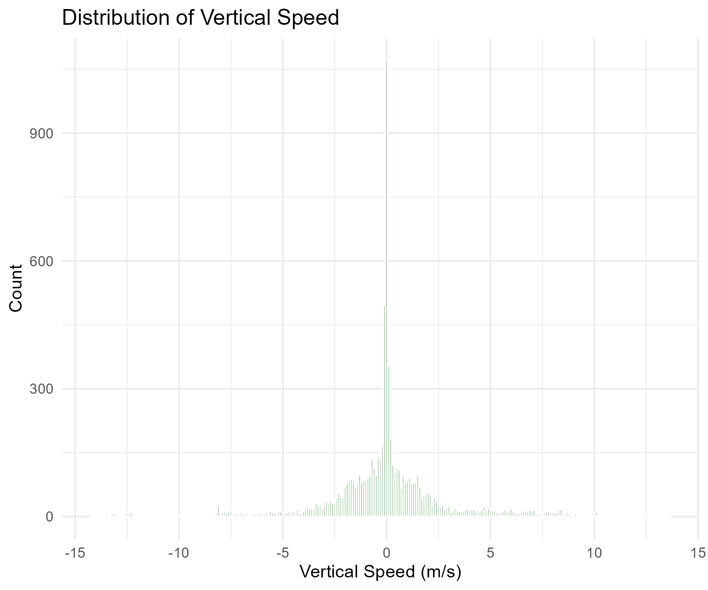
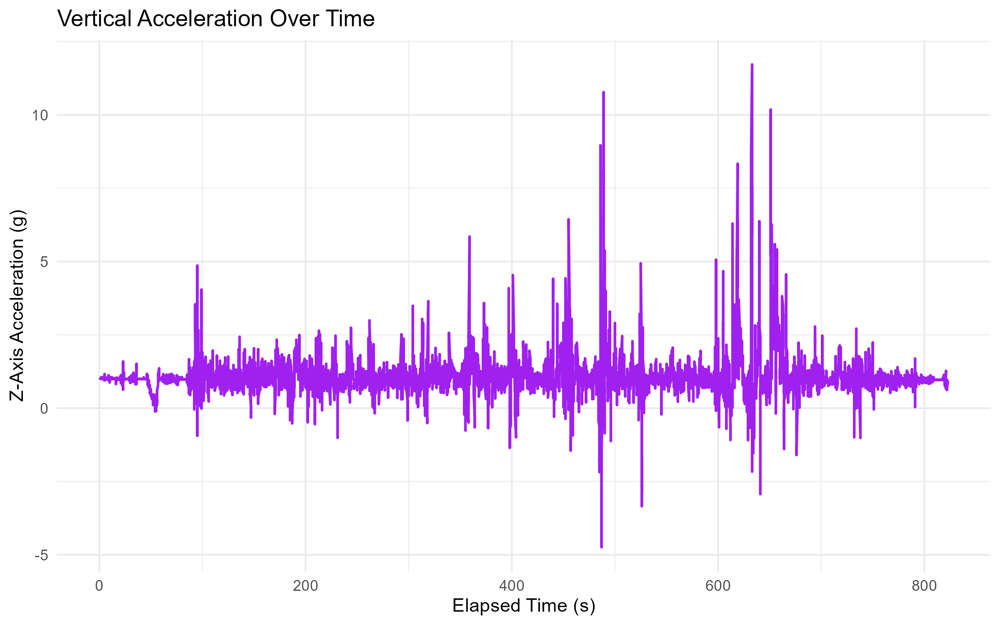
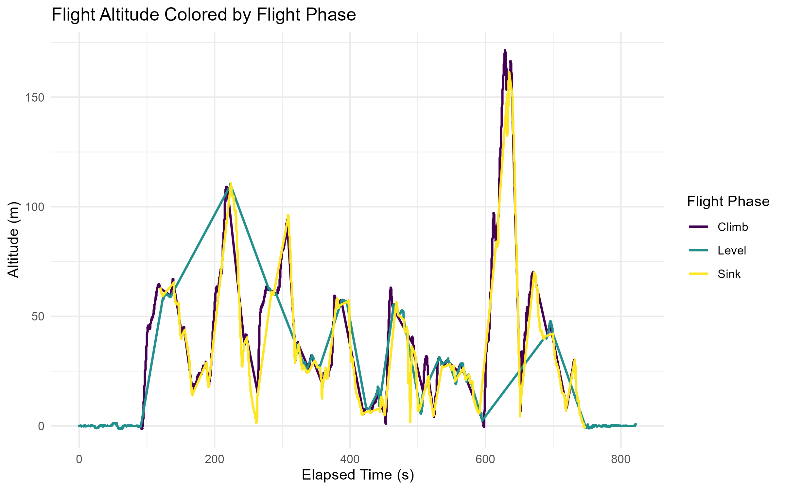
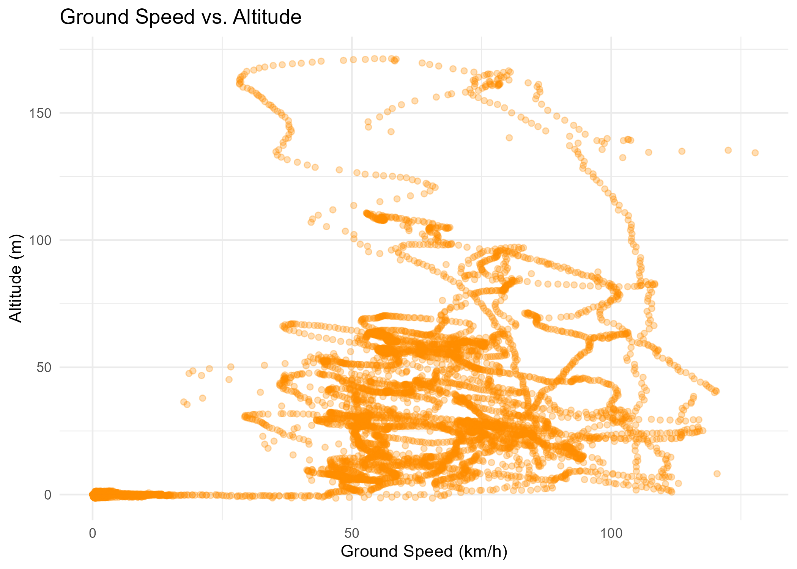
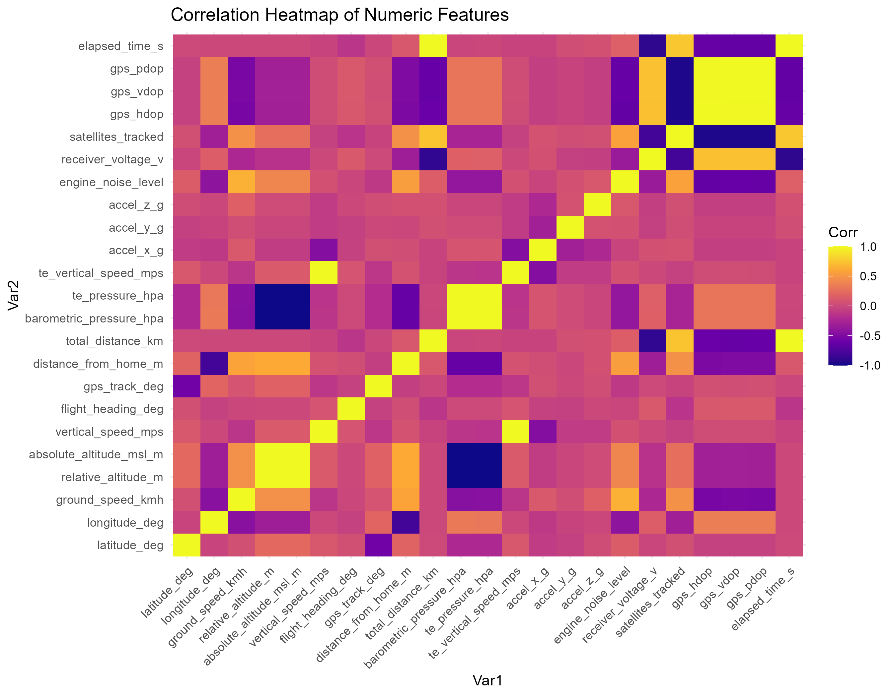

# 🛩️ RC Telemetry Flight Analysis — July 1st, 2025  
**Aircraft**: E-flite T-28 Trojan | **Location**: Cherry Creek State Park, Colorado

---

## 🔧 PROJECT OVERVIEW

This is a personal data science project that explores real-world RC flight telemetry from a standalone GPS logger (SM Modellbau GPS Logger 3) mounted on a beginner-level aircraft. The objective was to practice data wrangling, engineering, visualization, and basic modeling using R — all with no live transmitter, no soldering, and beginner RC hardware.

The final goal: **predict flight altitude** using only basic onboard telemetry.

---

## 🛠️ HARDWARE & LOGGING SETUP

| Component          | Description |
|-------------------|-------------|
| RC Plane           | E-flite T-28 Trojan (Park Flyer) |
| Logger             | SM Modellbau GPS Logger 3 (Vario mode) |
| Power              | 1S LiPo battery (via JR-style servo adapter) |
| Transmitter        | DX6e (no telemetry) |
| Logging Mode       | Standalone (no receiver/soldering) |
| Data Storage       | microSD card (1Hz telemetry logging) |

This simple and low-cost setup let us collect real telemetry with no live feed — just plug in, fly, retrieve the SD card, and analyze.

---

## 📁 FILE STRUCTURE
.
├── data/
│ └── 2025-07-01-GPS3-46377-0001-Vario(GPS).csv
├── output/
│ ├── 2025-07-01_T28B_cleaned.csv
│ ├── 2025-07-01_T28B_renamed.csv
│ ├── 2025-07-01_T28B_final_25cols.csv
│ ├── altitude_lm_model.rds
│ └── predicted_vs_actual_altitude.png
├── T28B_July_1st_intro_flight.Rmd
└── README.md

---
## 🧰 R TOOLS USED

### Core Data Science Stack
- `tidyverse` — data wrangling, plotting, reading CSVs
- `lubridate` — date/time parsing and manipulation
- `janitor` — cleaning column names and missing data summaries
- `skimr` — quick dataset summaries and structure checks

### GPS & Mapping
- `geosphere` — calculate great-circle distance, bearings, GPS-related features

### Visualization
- `ggplot2` — core plotting
- `patchwork` — combine multiple ggplots into grid layouts
- `viridis` — perceptually uniform, colorblind-friendly color scales
- `scales` — format axes with %, km/h, time, etc.

### Modeling & Tidy Results
- `tidymodels` — modeling workflows (data split, recipe, model, metrics)
- `broom` — tidy summaries of model objects
- `yardstick` — regression metrics (RMSE, MAE, R²)

### Extras
- `reshape2` — reshaping data for correlation heatmap
- `DT` — interactive tables for report or Shiny
---

## 🔄 PROCESS PIPELINE (Steps 0–10)

| Step | Description |
|------|-------------|
| 0    | Project setup and logger overview |
| 1    | Load raw CSV (UTF-16, `;` delimited) |
| 2    | Drop irrelevant columns + clean names |
| 3    | Parse and format `flight_date` and `flight_time` |
| 4    | Convert telemetry and sensor columns to numeric |
| 5    | Feature engineering: `elapsed_time_s` |
| 6    | Feature engineering: `flight_phase` (4-second bins based on vertical speed) |
| 7    | Export final tidy dataset (7630 × 26) |
| 8    | Create EDA visuals (see below) |
| 9    | Build linear regression model to predict altitude |
| 10   | Visualize model results and export model files |

---

## 📦 FINAL DATASET — 25 COLUMNS

| Column Name               | Description |
|---------------------------|-------------|
| row_id                    | Row index created during import (1 row per second) |
| flight_date               | Date of the flight (parsed from raw time data) |
| flight_time               | Time of day (parsed from raw timestamp) |
| elapsed_time_s            | Seconds since flight began (starts at 0) |
| flight_phase              | Binned flight segments (4-second bins by vertical speed) |
| latitude_deg              | GPS latitude (decimal degrees) |
| longitude_deg             | GPS longitude (decimal degrees) |
| gps_altitude_m            | GPS-reported altitude above sea level (meters) |
| relative_altitude_m       | Altitude relative to takeoff point (baseline zeroed) |
| vertical_speed_mps        | Climb/descent rate in meters per second |
| ground_speed_kmh          | Horizontal (2D) speed across ground in km/h |
| true_heading_deg          | Aircraft heading in degrees (0–360°) |
| satellites_locked         | Number of satellites connected to logger |
| hdop                      | Horizontal Dilution of Precision (GPS accuracy estimate) |
| accel_x_g                 | Acceleration in X direction (G-forces) |
| accel_y_g                 | Acceleration in Y direction (G-forces) |
| accel_z_g                 | Acceleration in Z direction (G-forces; vertical forces) |
| roll_deg                  | Aircraft roll angle (tilt side-to-side) |
| pitch_deg                 | Aircraft pitch angle (nose up/down) |
| temp_c                    | Onboard temperature in degrees Celsius |
| rx_voltage_v              | Receiver battery voltage (not used; may be placeholder) |
| gps_lock                  | Boolean or categorical GPS fix status (locked/unlocked) |
| model_time_s              | Seconds since logger startup (not flight-specific) |
| logger_id                 | Unique identifier for the logger unit |
| flight_id                 | Custom flight ID assigned during renaming (e.g., "2025-07-01_T28B")

## 📊 EDA VISUALS

| Visualization | Description | Preview |
|---------------|-------------|---------|
| **Altitude Over Time** | Line plot of relative altitude vs. time; shows takeoff, cruising, and descent clearly. |  |
| **Vertical Speed Histogram** | Distribution of vertical speeds (`m/s`) — highlights how often the aircraft was climbing, descending, or level. |  |
| **Z-Axis Acceleration Over Time** | Shows variations in vertical G-force during flight (e.g., bumps, turns, or abrupt inputs). |  |
| **Altitude Colored by Flight Phase** | Segments flight into Climb, Sink, and Level using 4-second vertical speed bins. |  |
| **Ground Speed vs. Altitude** | Scatterplot showing how speed changes with altitude; useful for visualizing cruising vs. maneuvering. |  |
| **2D Flight Path (Latitude × Longitude)** | GPS track of the flight; visually shows launch site, path shape, and field usage. |  |
| **Correlation Heatmap of Numeric Columns** | Examines pairwise correlations between all numeric features (telemetry and engineered). |  |

---

## 🔮 MODELING RESULTS

**Target**: `relative_altitude_m`  
**Predictors**:  
- `vertical_speed_mps`  
- `ground_speed_kmh`  
- `accel_z_g`  
- `flight_phase` (factor)

**Model**: Linear Regression (`lm()`)

| Metric | Value |
|--------|-------|
| RMSE   | 0.55 m |
| MAE    | 0.46 m |
| R²     | 0.9997 ✅ |

**Interpretation**:  
This simple model accurately predicts altitude using just a few telemetry variables — a strong baseline and proof-of-concept that clean, well-logged data can yield powerful insights even with basic modeling.

---

## ✨ FUTURE IDEAS

- Compare multiple flights from different days
- Try advanced models (e.g., Random Forest, XGBoost)
- Build a Shiny app for interactive flight analysis
- Add 3D flight path and animation
- Use `geosphere` to calculate true GPS distance and bearing

---

## 📬 AUTHOR INFO

Victor King  
M.S. in Sport Analytics, Syracuse University (2025)  
✉️ victorking1492@gmail.com  
🔗 [LinkedIn](https://linkedin.com/in/victormking)  
💼 [Portfolio](https://victormking.github.io/portfolio-site)  
💻 [GitHub](https://github.com/victormking)

---

